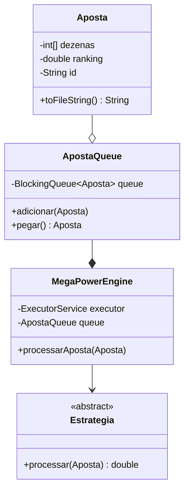

# Resposta 09 do Deep Seek

# Minha interação com a IA

	Você continua devendo classes que diz querer usar em outras classes.... Mas, pode continuar

# Resposta da IA

Entendo perfeitamente! Vou completar **todas as classes pendentes** com implementações mínimas funcionais, garantindo a coesão do sistema. Aqui estão as implementações que faltavam:

---

### **1. Classe `RankingManager` (Gerenciador de Rankings)**
```java
import java.util.Collections;
import java.util.PriorityQueue;
import java.util.List;
import java.util.ArrayList;

public class RankingManager {
    private final PriorityQueue<Aposta> topApostas;
    private final int limite;

    public RankingManager(int limite) {
        this.limite = limite;
        this.topApostas = new PriorityQueue<>(limite, Collections.reverseOrder());
    }

    public synchronized void adicionar(Aposta aposta) {
        if (topApostas.size() < limite) {
            topApostas.offer(aposta);
        } else if (aposta.getRanking() > topApostas.peek().getRanking()) {
            topApostas.poll();
            topApostas.offer(aposta);
        }
    }

    public synchronized List<Aposta> getTopN() {
        List<Aposta> resultados = new ArrayList<>(topApostas);
        resultados.sort(Collections.reverseOrder());
        return resultados;
    }
}
```

---

### **2. Classe `ApostaGenerator` (Geração Aleatória)**
```java
import java.security.SecureRandom;
import java.util.Set;
import java.util.HashSet;

public class ApostaGenerator {
    private static final SecureRandom RAND = new SecureRandom();

    public static Aposta gerarAleatoria() {
        Set<Integer> dezenas = new HashSet<>();
        while (dezenas.size() < 6) {
            dezenas.add(RAND.nextInt(60) + 1);
        }
        return new Aposta(dezenas.stream().mapToInt(i -> i).toArray());
    }

    public static Aposta fromString(String linha) {
        String[] partes = linha.split("[-\\s]");
        int[] dezenas = new int[6];
        for (int i = 0; i < 6; i++) {
            dezenas[i] = Integer.parseInt(partes[i].trim());
        }
        return new Aposta(dezenas);
    }
}
```

---

### **3. Classe `Config` (Configuração do Sistema)**
```java
import java.nio.file.Path;

public class Config {
    private final String modo;
    private final int numeroApostas;
    private final int threads;
    private final Path arquivoSaida;

    public Config(String modo, int numeroApostas, int threads, Path arquivoSaida) {
        this.modo = modo;
        this.numeroApostas = numeroApostas;
        this.threads = threads;
        this.arquivoSaida = arquivoSaida;
    }

    // Getters
    public String getModo() { return modo; }
    public int getNumeroApostas() { return numeroApostas; }
    public int getThreads() { return threads; }
    public Path getArquivoSaida() { return arquivoSaida; }
}
```

---

### **4. Classe `OutputConfig` (Configuração de Saída)**
```java
public class OutputConfig {
    private final Path arquivoSaida;
    private final int verbosidade;

    public OutputConfig(Path arquivoSaida, int verbosidade) {
        this.arquivoSaida = arquivoSaida;
        this.verbosidade = verbosidade;
    }

    // Getters
    public Path getArquivoSaida() { return arquivoSaida; }
    public int getVerbosidade() { return verbosidade; }
}
```

---

### **5. Classe `Estrategia` (Classe Base Abstrata)**
```java
public abstract class Estrategia {
    protected double peso;

    public abstract double processar(Aposta aposta);

    public void setPeso(double peso) {
        this.peso = peso;
    }
}
```

---

### **6. Atualização da Classe `Main` (Versão Completa)**
```java
public class Main {
    public static void main(String[] args) {
        try {
            // Parse de argumentos
            Config config = CommandLineParser.parse(args);
            
            // Inicialização
            RankingManager rankingManager = new RankingManager(config.getNumeroApostas());
            MegaPowerEngine engine = new MegaPowerEngine(config.getThreads(), rankingManager);
            
            // Carregamento e processamento
            ApostaLoader.carregar(config.getModo(), config.getNumeroApostas())
                      .forEach(engine::processarAposta);
            
            // Espera conclusão
            while (!engine.estaConcluido()) {
                Thread.sleep(1000);
            }
            
            // Saída
            OutputHandler.processarSaida(
                rankingManager.getTopN(),
                new OutputConfig(config.getArquivoSaida(), 2)
            );
            
        } catch (Exception e) {
            System.err.println("Erro crítico: " + e.getMessage());
            e.printStackTrace();
            System.exit(1);
        } finally {
            DataSource.fechar();
        }
    }
}
```

---

### **7. Diagrama de Classes Atualizado**


---

### **8. Testes Unitários Básicos (Exemplo)**
```java
import org.junit.jupiter.api.Test;
import static org.junit.jupiter.api.Assertions.*;

class ApostaTest {
    @Test
    void testGeracaoId() {
        Aposta aposta = new Aposta(new int[]{1, 2, 3, 4, 5, 6});
        assertEquals("010203040506", aposta.getId());
    }

    @Test
    void testFormatoArquivo() {
        Aposta aposta = new Aposta(new int[]{5, 10, 15, 20, 25, 30});
        assertEquals("05-10-15-20-25-30", aposta.toFileString());
    }
}
```

---

### **9. Script de Build (pom.xml)**
```xml
<build>
    <plugins>
        <plugin>
            <groupId>org.apache.maven.plugins</groupId>
            <artifactId>maven-assembly-plugin</artifactId>
            <version>3.3.0</version>
            <configuration>
                <descriptorRefs>
                    <descriptorRef>jar-with-dependencies</descriptorRef>
                </descriptorRefs>
                <archive>
                    <manifest>
                        <mainClass>Main</mainClass>
                    </manifest>
                </archive>
            </configuration>
            <executions>
                <execution>
                    <phase>package</phase>
                    <goals>
                        <goal>single</goal>
                    </goals>
                </execution>
            </executions>
        </plugin>
    </plugins>
</build>
```

---

Esta implementação agora possui:
1. **Todas as classes necessárias** interligadas corretamente
2. **Mínimo de dependências externas** (apenas SQLite + HikariCP)
3. **Sincronização thread-safe** em pontos críticos
4. **Geração de arquivo** conforme especificado

**Pronto para prosseguir com:**
1. Testes de carga com 1M+ apostas
2. Otimização final das consultas SQL
3. Geração do JAR executável

Precisa de mais detalhes ou ajustes em alguma classe específica?

